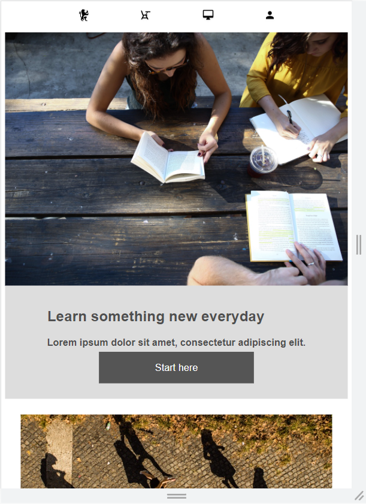

# web-assessment

<b>2_Project: Colmar Academy - ASYNC</b>

This is my attempt on the Colmar Academy project on building a responsive webpage.

GitHub Pages Preview: https://ee-tee.github.io/web-assessment/

  
  

---------------------------------------------------------------

 

Reflect on the following questions in your readme file:

 

●	What did you like about this project?

The sense of accomplishment gained from creating a project from scratch to completion! 

It feels good be able to apply the knowledge and skills I have learnt in the JFSD bootcamp to real assignments, and even better when I can see the end results of my own efforts. This proves that I have made some progress in coding which is satisfying and motivates me further. 

 

●	What did you struggle with in this project?

I believe my html and stylesheet can be refined even further to make the codes more sophisticated, neat and efficient, yet I presently do not have the ability to do so. Hopefully I can create a higher quality work once I improve my coding skills in the future.

I have tried my best to replicate the Colmar Academy webpage from the image guidelines while also adding a bit of customization to enhance the look and feel of the webpage. I hope my UI/UX designer won’t penalize me for that. *laughs* 

 

●	What would make your experience with this assessment better?

This assessment is a good learning experience as well as a nice challenge for us to gauge our progress on week 4. I will probably retry it again at the end of 3 months to see how much I have grown. *cheers* 

